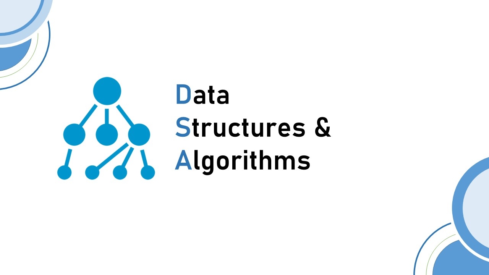

# 450dsa
   

Learning by solving the sheet available at https://450dsa.com that covers almost every questions to prepare for Data Structures and Algorithms.

## Contribute
- Help to grow the community and learning.
- Make your valuable contributions to this project by adding your better solutions in widely used programming languages.
- Willing to consider new ideas.

## Content
- [Arrays](Array)
- [Matrix](Matrix)
- [Strings](String)
- [Searching and Sorting](Search%20and%20Sort)
- [Linked List](Linked%20List)
- [Bit Manipulation](Bit%20Manipulation)
- [Greedy](Greedy)
- [Backtracking](Backtracking)
- [Dynamic Programming](Dynamic%20Programming)
- [Stacks and Queues](Stacks%20and%20Queue)
- [Binary Trees](Binary%20Tree)
- [Binary Search Tree](BST)
- [Graphs](Graph)
- [Heap](Heap)
- [Trie](Trie%20Data%20Structure)

---

### Source 

[Love Babbar](https://www.linkedin.com/in/love-babbar-38ab2887/)